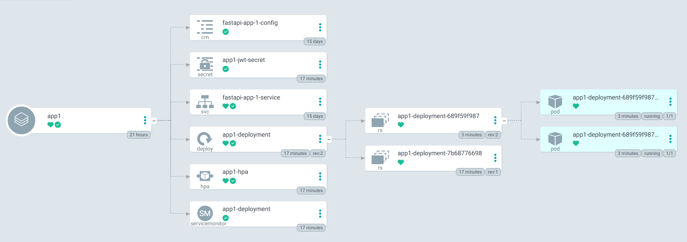

# Kubernetes Sandbox

## Components

```markdown
| Kubernetes           | ECS Equivalent               | Purpose                                                          |
| -------------------- | ---------------------------- | ---------------------------------------------------------------- |
| **Control Plane**    | EKS Control Plane (AWS)      | API server, scheduler, controller manager                        |
| **Controller**       | ECS Service Scheduler        | Watches resource state and drives changes to match desired state |
| **Pod**              | Task                         | Smallest deployable unit (1+ containers)                         |
| **Deployment**       | Service + Task Definition    | Manages rollout, replicas, and health                            |
| **Service**          | Load Balancer Target Group   | Stable IP/DNS for a group of Pods                                |
| **Node**             | EC2 Instance or Fargate Task | Worker machine that runs Pods                                    |
| **Cluster**          | ECS Cluster                  | A group of Nodes managed by control plane                        |
| **Ingress**          | API Gateway / ALB            | Exposes Services to the outside world (Layer 7)                  |
| **ConfigMap/Secret** | Parameter Store / SecretsMgr | Inject config and secrets into apps                              |
| **ServiceMonitor**   | AWS Service for Prometheus   | Defines scraping configuration for Services to collect metrics   |

```

### Ingress

- Layer 7 (HTTP)
- customized routing via hostnames and path rules
- reverse proxy in front of multiple Services

#### Ingress Controllers

- cluster-level infrastructure
- usually stored in separate namespace from apps

#### Ingress Resources

- YAML files that mapp `myapp.example.com` --> `app1 service`
- should be in same namespace as app/service they expose
  - `ingress controller` will see them and route traffic accordingly, even though different namespaces

## Project Layout

```markdown
├── eks/
│   ├── app1/
│   ├── app2/
│   ├── auth/
│   ├── ingress_alb/
│   ├── ingress_nginx_api/
│   ├── ingress_nginx_frontend/
│   ├── monitoring/
│   ├── grafana/
│   ├── applications_sets/
│   └── ...
├── react-frontend/
├── local/
├── hey.exe
├── Makefile
├── README.md
└── ...
```

Main components:

- Microservices: `app1`, `app2`, `auth` (FastAPI)
- Frontend: `react-frontend` (React + Vite)
- Kubernetes manifests & Helm charts: `*-deployment/`, `ingress_*`, `monitoring/`, `grafana/`
- Local dev: `local/`

## Prerequisites

- [k3d](https://k3d.io/stable/) (local Kubernetes cluster)
  - Install: `choco install k3d`
- [kubectl](https://kubernetes.io/docs/tasks/tools/)
- [Helm](https://helm.sh/docs/intro/install/)
- [hey](https://github.com/rakyll/hey) (load testing)
  - Download and place `hey.exe` in project root

---

## Quick Starts

### Quick Start (Local)

1. **Start k3d cluster**

   ```powershell
   k3d cluster create demo `
     --agents 1 `
     --port "80:80@loadbalancer" `
     --k3s-arg "--disable=traefik@server:0"
   ```

2. **Install Nginx Ingress Controller**

   ```powershell
   helm repo add ingress-nginx https://kubernetes.github.io/ingress-nginx
   helm repo update
   helm install ingress-nginx ingress-nginx/ingress-nginx `
     --namespace alex-sandbox `
     --create-namespace
   ```

3. **Deploy microservices**

   ```powershell
   kubectl apply -f eks/app1-deployment/argocd-dev.yaml
   kubectl apply -f eks/app2-deployment/argocd-dev.yaml
   kubectl apply -f eks/auth-deployment/argocd-dev.yaml
   ```

4. **Access services**

   - App1: `http://localhost/app1`
   - App2: `http://localhost/app2`
   - Auth: `http://localhost/auth`

### Quick Start (AWS EKS)

1. **Prerequisites**

   - AWS CLI configured
   - `kubectl` and `helm` installed
   - EKS cluster created and `kubectl` context set
   - ArgoCD CLI (optional)

2. **Install ArgoCD in EKS**

   ```powershell
   kubectl create namespace argocd
   kubectl apply -n argocd -f https://raw.githubusercontent.com/argoproj/argo-cd/stable/manifests/install.yaml
   ```

   - Get ArgoCD admin password:

     ```powershell
     kubectl -n argocd get secret argocd-initial-admin-secret -o jsonpath="{.data.password}" | base64 --decode
     ```

   - Port-forward ArgoCD UI:

     ```powershell
     kubectl port-forward svc/argocd-server -n argocd 8080:443
     ```

   - Access UI at: `https://localhost:8080` (username: `admin`)

3. **Deploy Applications via ApplicationSet**

   - Edit and apply the ApplicationSet manifest:

     ```powershell
     kubectl apply -f eks/applications_sets/application_set.yaml
     ```

   - This will create ArgoCD applications for each microservice (app1, app2, auth) using the provided Helm charts and values files.

4. **Sync and Monitor Deployments**

   - Use ArgoCD UI or CLI to sync applications and monitor status.

   - Example CLI sync:

     ```powershell
     argocd app sync app1
     argocd app sync app2
     argocd app sync auth
     ```

5. **Access Services**

   - Use the configured ingress (ALB, Nginx, etc.) to access your services.

   - Example URLs (replace with your actual ALB DNS):

     - App1: `http://<alb-dns>/app1`
     - App2: `http://<alb-dns>/app2`
     - Auth: `http://<alb-dns>/auth`

See `eks/applications_sets/application_set.yaml` and deployment folders for customization.

### Quick Start (Makefile)

You can use the provided `Makefile` to automate common deployment tasks for both local and AWS EKS environments.

#### Usage

Typical commands:

##### Local Deployment

From `local/` directory:

  ```powershell
  make deploy-all  # deploy metalLB and four microservices
  ```

Additional targets and details can be found in `local/Makefile`.

##### AWS EKS Deployment

From `eks/` directory:

  ```powershell
  make deploy-nginx-controller  # deploy nginx controller for eks cluster
  make deploy-ingressclass-alb-controller  # deploy ALB controller for eks cluster
  make deploy-prometheus-stack  # deploys prometheus and grafana within the eks cluster
  maek deploy-ingress  # deploys nginx for api backend and alb for frontend (frontend can't have path rewrites)
  make argocd-create-namespace  # create argocd namespace (if not already created)
  make argocd-applicationset  # deploy four microservices from argocd applicationset
  ```

Additional targets and details can be found in `eks/Makefile`.

---

## Authenticating Kubernetes Dashboard

1. Create an `admin‑user` ServiceAccount and give it `cluster‑admin` rights
2. Bind it to the `cluster‑admin` role
3. Generate token to sign into metrics dashboard

```powershell
# 1) Create the ServiceAccount
kubectl create **serviceaccount** admin-user -n kubernetes-dashboard

# 2) Bind it to the cluster‑admin role
kubectl create clusterrolebinding admin-user `
  --clusterrole=cluster-admin `
  --serviceaccount=kubernetes-dashboard:admin-user

# 3) Now you can generate the token
kubectl -n kubernetes-dashboard create token admin-user
```

## Commands

### Helm

- create templates that can be reused

#### Helm Deploy

- `helm create <name>` - will create folder called `name` with subfolders for `values.yaml` and `templates/`

#### Helm Upgrade

```powershell
helm upgrade ingress-nginx ingress-nginx/ingress-nginx `
  --namespace alex-sandbox `
  --values values.yaml
```

```powershell
helm upgrade ingress-nginx ./ingress_nginx_controller `
  --namespace alex-sandbox `
  --values ./ingress_nginx_controller/values.yaml
```

#### Helm Verify Deployments

- verify `ingress-nginx` `pod` listening on port `10254` and serving `Prometheus` metrics

```powershell
$pod = kubectl get pods -n alex-sandbox -l app.kubernetes.io/name=ingress-nginx -o jsonpath='{.items[0].metadata.name}'

kubectl exec -it $pod -n alex-sandbox -- curl -s localhost:10254/metrics | Select-Object -First 10
```

- get full configuration details of controller deployment

```powershell
kubectl get deployment ingress-nginx-controller -n alex-sandbox -o yaml
```

### Traefik (Nginx alternative)

Install `Traefik` (`Nginx` alternative):

```bash
kubectl create namespace ingress-traefik

helm repo add traefik https://helm.traefik.io/traefik
helm repo update

helm install traefik traefik/traefik --namespace ingress-traefik
```

### Nginx

```bash
k3d cluster create demo `
  --agents 1 `
  --port "80:80@loadbalancer" `
  --k3s-arg "--disable=traefik@server:0"
```

- Install `Nginx` Ingress Controller:
  - specifying `controller.service.type` as `LoadBalancer` which causes `MetalLB` to auto-assign IP from its pool
  - install in own custom `namespace`
    - Ingress Controller is a cluster-wide resource

```powershell
helm repo add ingress-nginx https://kubernetes.github.io/ingress-nginx
helm repo update

helm install ingress-nginx ingress-nginx/ingress-nginx `
  --namespace ingress-nginx `
  --create-namespace `
  --set controller.metrics.enabled=true `
  --set controller.metrics.port=10254 `
  --set controller.metrics.service.enabled=true `
  --set controller.metrics.service.port=10254 `
  --set controller.metrics.service.targetPort=10254 `
  --set controller.metrics.serviceMonitor.interval=30s `
  --set controller.metrics.serviceMonitor.selector.matchLabels.release=prometheus-stack
```

- if didn't install prometheus helm chart yet, just leave off `--set controller.metrics.serviceMonitor.enabled=true `

For exporting metrics to be consumed by `grafana`:

```powershell
helm upgrade ingress-nginx ingress-nginx/ingress-nginx `
  --namespace alex-sandbox `
  --install `
  --reset-values `
  --set controller.metrics.enabled=true `
  --set controller.metrics.service.enabled=true `
  --set controller.metrics.service.port=10254 `
  --set controller.metrics.serviceMonitor.enabled=true `
  --set controller.metrics.serviceMonitor.interval=30s `
  --set controller.metrics.serviceMonitor.selector.matchLabels.release=prometheus-stack
```

- can also edit in file - `kubectl -n alex-sandbox edit deployment ingress-nginx-controller`

- Run `Nginx` Ingress Controller:
  - `kubectl apply -f https://raw.githubusercontent.com/kubernetes/ingress-nginx/controller-v1.10.1/deploy/static/provider/kind/deploy.yaml`
    - necessary to be able to run `Nginx` Ingress Pod

- Sometimes the ingress-nginx-controller is set to run only on labeled nodes (like ingress-ready=true), which k3d nodes don’t have by default.
  - Can fix it by patching the node:
    - `kubectl label node k3d-demo-server-0 ingress-ready=true`

#### NodePort = 30080

- Exposure: external on each node’s IP + port

- `docker build -t fastapi-app1 -f Dockerfile_app1 .`
- `k3d cluster create demo -p "30080:30080@loadbalancer"` (create `k3d` cluster)
  - `@loadbalancer` - refers to special container spun up by `k3` - `k3d-demo-loadbalancer`
  - exposes port `30080` to local machine
  - if want additional ports available on local machine have to add them when creating cluster
    - ex: `Grafana` default port of `3000`

      ```powershell
        k3d cluster create demo `
          --agents 1 `
          --port "30080:30080@loadbalancer" `
          --port "3000:3000@loadbalancer" `
          --k3s-arg "--disable=traefik@server:0"
      ```

- run `Nginx` Ingress Controller:
  - `kubectl apply -f https://raw.githubusercontent.com/kubernetes/ingress-nginx/controller-v1.10.1/deploy/static/provider/kind/deploy.yaml`
    - necessary to be able to run `Nginx` Ingress Pod
  - wait for `Pods` to start - `kubectl get pods -n ingress-nginx`
- `k3d image import fastapi-app1 -c demo` (import image into `k3d`)
- `kubectl apply -f fastapi-deployment.yaml.yaml` (apply kubernetes resource)
- `kubectl apply -f fastapi-service-nodeport.yaml` (apply kubernetes resource)
- can now access `http://localhost:30080/`

#### ClusterIP Port 80

- Exposure: internal-only (pod‑to‑pod within cluster)

- `docker build -t fastapi-app1 -f Dockerfile_app1 .`
- `k3d cluster create demo --agents 1 --port "80:80@loadbalancer" --k3s-arg "--disable=traefik@server:0"`
  - create `k3d` cluster
  - `@loadbalancer` - refers to special container spun up by `k3` - `k3d-demo-loadbalancer`
  - exposes port `80` to local machine
  - if want additional ports available on local machine have to add them when creating cluster
    - ex: `Grafana` default port of `3000`

      ```powershell
        k3d cluster create demo `
          --agents 1 `
          --port "80:80@loadbalancer" `
          --port "3000:3000@loadbalancer" `
          --k3s-arg "--disable=traefik@server:0"
      ```

- run `Nginx` Ingress Controller:
  - `kubectl apply -f https://raw.githubusercontent.com/kubernetes/ingress-nginx/controller-v1.10.1/deploy/static/provider/kind/deploy.yaml`
    - necessary to be able to run `Nginx` Ingress Pod
  - wait for `Pods` to start - `kubectl get pods -n ingress-nginx`
- `k3d image import fastapi-app1 -c demo` (import image into `k3d`)
- `kubectl apply -f fastapi-deployment-app1.yaml` (apply kubernetes resource)
- `kubectl apply -f fastapi-service-clusterip.yaml` (apply kubernetes resource)
- `kubectl apply -f fastapi-ingress.yaml` (apply kubernetes resource)
- can now access `http://localhost`

#### Deploy Apps

- use `Makefile`

### Updating Code on Pod(s)

#### Restart Deployment

- `kubectl rollout restart deployment fastapi-app1`

#### Force Delete Pods to Force Redeployment (if restart fails)

- `kubectl delete pods -l app=fastapi-app1`
  - `app=fastapi-app1` - refers to the `Deployment` name
  - should not use in PROD - instead update `deployment.yaml` with new image and Kubernetes will auto-shutdown and launch new `Pod(s)`

```bash
image: <account>.dkr.ecr.<region>.amazonaws.com/myapp:1.2.3
imagePullPolicy: IfNotPresent
```

### Controller

- individual workers inside a `control plane`, each responsible for a particular kind of object
- each resource kind only needs a single `controller` active in the `control plane`

#### Nginx Ingress Controller

- self-managed L7 proxy giving full control over routing rules

#### ALB Ingress Controller

- auto‑scales, integrates with WAF, Cognito, and VPC networks

## Additional Components Used with Kubernetes

### Traefik (Nginx alternative) Setup

- `Traefik` - cluster with Ingress controller already configured
  - `k3d cluster create demo --agents 1 --port "80:80@loadbalancer" --k3s-arg "--disable=traefik@server:0"`
  - install - sets up Traefik to listen on port 80 and route based on Ingress rules

  ```bash
  kubectl create namespace ingress-traefik

  helm repo add traefik https://helm.traefik.io/traefik
  helm repo update

  helm install traefik traefik/traefik --namespace ingress-traefik
  ```

### Nginx Setup

`kubectl apply -f https://raw.githubusercontent.com/kubernetes/ingress-nginx/controller-v1.10.1/deploy/static/provider/kind/deploy.yaml`

Creates:

- `Deployment`: `ingress-nginx-controller`
- `Service`: type `NodePort`
- `Namespace`: `ingress-nginx`

### Ingress

- `Ingress` - manages external access to `Services` inside a Kubernetes cluster
  - think of like:
    - a reverse proxy (`ngnix`) that receives HTTP traffic and routes to correct service based on defined rules
    - an `AWS API Gateway`
  - `Ingress Rules` - think of like `ALB Listener Rules` to direct traffic to `Pods`
  - without `Ingress`:
    - need to expose each `Service` with separate `NodePort`
    - change ports manually
  - consolidates all `Services` behind single port (`80`, `443`, etc.)
  - allow path-based routing (`/api`, `/app`, etc.)
  - supports host-based routing (`app.example.com`, `api.example.com`, etc.)
  - TLS termination (HTTPS support)
  - what's defined in `Ingress` YAML file:
    - routing rules:
      - `/app-a` requests go to `service-a`
      - `Ingress Controller` - a `Pod` that setups routing inside `Cluster`
        - this is the reverse proxy making everything happening

  ```bash
  Browser
    ↓
  localhost:80
    ↓
  Ingress Controller (Traefik/Nginx)
    ↓             ↓
  /path-a       /path-b
    ↓             ↓
  Service A    Service B
    ↓             ↓
  Pod A        Pod B
  ```

## Helm Charts

- template YAML scripts (`Deployment`, `Service`, etc.)

### Helm Commands

#### Render Template with `values.yaml` Applied

- `helm template -s templates/<template_filename> .`

#### Get Public Helm Charts

- `helm repo add bitnami https://charts.bitnami.com/bitnami`
  - download the public charts
- `helm repo update`
  - update the local repos
- `helm repo add bitnami https://charts.bitnami.com/bitnami`
  `helm repo update`
  `helm install my-redis bitnami/redis`

#### Create Helm Charts

- `helm create <app_name>`
  - scaffold `Helm` chart directory for `<app_name>`

```bash
<app_name>/
├── charts/               # **sub**charts (optional dependencies)
├── templates/            # where to put custom Helm charts
│   ├── deployment.yaml
│   ├── service.yaml
│   ├── ingress.yaml
│   ├── hpa.yaml
│   ├── serviceaccount.yaml
│   └── tests/
│       └── test-connection.yaml
├── values.yaml           # configuration values to use in Helm charts
├── Chart.yaml            # metadata (name, version, description)
└── .helmignore           # files to ignore when packaging the chart
```

#### View Helm Generated Chart Before Deployment

- `helm template <name_of_release> <folder_name>/`
  - ex: `helm template fastapi-ingress ingress/`

## Horizontal Pod Autoscaling (HPA)

### HPA Purpose

- Increased request volume
  - Traffic spikes and service threads/processes per pod aren’t enough to keep latency down
  - HPA spins up more replicas so each one handles fewer requests
- CPU/memory pressure in‐flight
  - Batch job or heavy query suddenly drives CPU/memory above your threshold
  - HPA reacts to real‑time metrics and adds pods to keep each under safe limits
- Feature‑specific scaling
  - CPU‑bound endpoint and “metadata” endpoint that’s light - autoscale pods on CPU for the former and leave latter static

### HPA Setup

- install **Metrics Server** - `kubectl apply -f https://github.com/kubernetes-sigs/metrics-server/releases/latest/download/components.yaml`
- stream CPU usage - `kubectl get hpa -w`
  - event driven - only prints when `HPA` object changes

### Generate Artificial Load to Trigger HPA

#### Install `hey` to Generate Load

- Download `hey` executable from [GitHub](https://github.com/rakyll/hey)
  - rename downloaded executable to `hey.exe` and move into local dir
- `.\hey.exe -z 30s -c 10 http://localhost/`
  - run for `30s`
  - `10` connections per second

#### Monitor Number of Pods Running

- `bash`:

```bash
watch -n 2 kubectl get deployment fastapi-app1-deployment
```

- `powershell`:

```bash
while ($true) {
  kubectl get deployment fastapi-app1-deployment
  Start-Sleep -Seconds 2
}
```

#### Scale Up/Down Timing

- Scale up happens immediately when CPU utilization over threshold
- Scale down only after a stabilization window (default 300 seconds) to avoid flapping
  - Can set to be lower when creating cluster

    ```bash
    k3d cluster create demo `
      --agents 1 `
      --port "80:80@loadbalancer" `
      --k3s-arg "--disable=traefik@server:0" `
      --k3s-arg "--kube-controller-arg=--horizontal-pod-autoscaler-downscale-stabilization=60s@server:0"
    ```

## Prometheus and Grafana - Visualize Metrics

### Prometheus Setup

- add `Helm` repo - `kube-prometheus-stack`
  - `helm repo add prometheus-community https://prometheus-community.github.io/helm-charts`
    `helm repo update`
- make dedicated directory for montioring
  - `mkdir -p monitoring`
    `cd monitoring`
- install `Helm` chart

    ```bash
    helm install monitoring prometheus-community/kube-prometheus-stack `
      --namespace monitoring `
      --create-namespace
    ```

  - installs:
    - `Prometheus`
    - `Grafana`
    - Node Exporter
    - Kube State Metrics
    - Alertmanager

#### Prometheus - Force Restart

- `kubectl delete pod -l app.kubernetes.io/name=prometheus -n monitoring`
  - deletes pod and forces restart

#### Prometheus - Run Pods

```powershell
kubectl port-forward svc/monitoring-kube-prometheus-prometheus -n monitoring 9090:9090
```

- `Prometheus` running as a Pod from the `kube-prometheus-stack Helm chart`

- verify Pods running with: `kubectl get pods -n monitoring | findstr prometheus`
- verify Services with: `kubectl get svc -n monitoring | findstr prometheus`
- access `Prometheus` dashboard on `localhost:9090`: `kubectl port-forward svc/monitoring-kube-prometheus-prometheus -n monitoring 9090:9090`
  - port forwards from `localhost` port `9090` to port `9090` in the `prometheus` Pod
  - `Prometheus` dashboard is similar to `Grafana` in that you execute `PromQL Queries` (`Prometheus Query Language`)
    - limited to single queries and can't build dashboard visualizations of multiple queries

##### PromQL (Prometheus Query Language) Query Examples

- `avg(rate(node_cpu_seconds_total{mode!="idle"}[5m])) by (instance)`
  - per‑node average CPU load over the last 5 minutes
- `100 * (1 - (node_memory_MemAvailable_bytes / node_memory_MemTotal_bytes))`
  - percent of RAM in use on each node

### Grafana Setup

- validate `grafana` `Service` deployment - `kubectl -n monitoring describe svc prometheus-stack-grafana`

#### Grafana Setup Locally

- patch the `Grafana` `Kubernetes Service` to use `NodePort` instead of `ClusterIP`
  - `kubectl patch svc monitoring-grafana -n monitoring -p "{\"spec\": {\"type\": \"NodePort\"}}"`
    - have to run with `CMD` and not `PowerShell`
  - by default it uses `ClusterIP` (for microservice-to-microservice communication)
  - `NodePort` allows communication from outside the `Kubernetes Cluster` via a fixed port
    - useful for **local** testing since no Load Balancer locally
  - needed to access `Grafana` dashboard from local machine
  - to undo and use `ClusterIP` again - meaning making internal-only again:
    - `kubectl patch svc monitoring-grafana -n monitoring -p '{"spec": {"type": "ClusterIP"}}'`
- view `monitoring-grafana` Service with:
  - `kubectl describe service monitoring-grafana -n monitoring` - gives full details
  - `kubectl get svc monitoring-grafana -n monitoring` - gets port assigned
    - used to access `Grafana` dashbaord at `localhost:<NodePort>`
- run `kubectl port-forward svc/monitoring-grafana -n monitoring 3000:80`
  - allows accessing `Grafana` dashboard at `localhost:3000`
  - credentials:
    - username: `admin`
    - password: `prom-operator`

#### Grafana Setup EKS

- install `Prometheus` (and the Prometheus Operator) via Helm
  - deploys `Prometheus`, Alertmanager, node-exporter, kube-state-metrics, and a default set of ServiceMonitor
  - easy to add new targets by creating ServiceMonitor or PodMonitor CRDs for your microservices

```powershell
helm repo add prometheus-community https://prometheus-community.github.io/helm-charts
helm repo update
helm upgrade --install prometheus prometheus-community/kube-prometheus-stack `
  --namespace monitoring --create-namespace
```

- expose `Grafana`
  - `kube‑prometheus‑stack` Helm chart installs `Grafana` by default as a `ClusterIP` service
    - must be updated to use `alb`

`grafana/values_aws_alb.yaml`

```yaml
grafana:
  ingress:
    enabled: true
    ingressClassName: alb
    annotations:
      # ALB-specific annotations
      alb.ingress.kubernetes.io/scheme: internet-facing
      alb.ingress.kubernetes.io/target-type: ip
      alb.ingress.kubernetes.io/listen-ports: '[{"HTTP":80}]'
    # a list of hostnames (strings), not maps
    hosts:
      - k8s-alexsand-fastapii-24220610c8-74839953.us-east-1.elb.amazonaws.com  # comes from ALB Ingress DNS A record
    # a simple list of path prefixes
    paths:
      - /grafana/*
```

- `Grafana` Helm update command to switch from `ClusterIP` to `LoadBalancer`
  - could have used `grafana/values_aws_alb.yaml` but then requires having in same `namespace` as apps and not separate `monitoring` namespace
  - `Service` of type `LoadBalancer` automatically provisions an ELB with Grafana pods as its back‑end endpoints
    - no Ingress, no rewrite rules, no cross‑namespace gymnastics
  - internal-only
    - `aws-load-balancer-internal: "true"`
    - get an ELB that's reachable only from inside your VPC/VPN
    - gives team a single, stable DNS name to bookmark—no port‑forwarding, no public exposure

```powershell
helm upgrade --install prometheus-stack prometheus-community/kube-prometheus-stack `
  --namespace monitoring --create-namespace `
  -f grafana/values_elb.yaml
```

- get `Grafana` dashboard password for default `admin` user

```powershell
# fetch the encoded password into a variable
$enc = kubectl -n monitoring get secret prometheus-stack-grafana `
  -o jsonpath="{.data.admin-password}"

# decode and print as UTF‑8
[System.Text.Encoding]::UTF8.GetString(
  [System.Convert]::FromBase64String($enc)
)
```

##### Getting Grafana Internal ELB URL

`kubectl -n monitoring get svc prometheus-stack-grafana -o jsonpath="{.status.loadBalancer.ingress[0].hostname}"`

##### Accessing Grafana Internal ELB Dashboard Locally

```powershell
kubectl port-forward svc/monitoring-grafana -n monitoring 3000:80
```

- can't access it via the ELB URL because it's internal only, even if set `aws-load-balancer-internal: "false"`
  - would need to assign public subnets in the VPC to the `grafana` `service`

#### Building First Grafana Dashboard

- `Dashboards` > `New` > `New dashboard` > `Add Visualization`
  - each `Visualization` is a `Panel`
  - can have multiple `Visualizations`/`Panels` per `Dashboard`
  - run 1+ `PromQL Queries` (`Prometheus Query Language`)

- `PromQL Query` examples:
  - Pod restarts: `increase(kube_pod_container_status_restarts_total{pod=~"fastapi-app1.*"}[5m])`
  - HPA replica count: `kube_horizontalpodautoscaler_status_current_replicas{horizontalpodautoscaler=~"fastapi-app1-hpa"}`
  - CPU usage per Pod: `rate(container_cpu_usage_seconds_total{pod=~"fastapi-app1.*", container!="POD"}[2m])`

#### Exporting/Importing Grafana Dashboards

- `Dashboards` > select Dashboard > `Export` > `Export as JSON`
  - store at `monitoring/dashboards`
- can import via Grafana web console or via `Helm` chart - `ConfigMap`

#### Altering Grafana `NGINX Ingress Controller` Dashboard

- code `9614` for importing `NGINX Ingress Controller` Grafana dashboard

##### Verifying Metrics Being Exported

```powershell
$pod = kubectl get pods -n alex-sandbox -l app.kubernetes.io/name=ingress-nginx -o jsonpath='{.items[0].metadata.name}'
kubectl exec -it $pod -n alex-sandbox -- curl -s localhost:10254/metrics | Select-String "nginx_ingress_controller"
```

## Argo CD

- watches Git repository
- when change seen to Kubernetes manifests (YAML), changes automatically applied to Kubernetes cluster
- keeps cluster in sync with Git repo - Git becomes audit log
- removes need for `kubectl apply`

Key features:

- Sync: Keeps your cluster in sync with Git
- Rollback: Roll back to previous states easily
- Diff: Shows what’s different between the cluster and Git
- UI: Has a nice web dashboard and CLI
- Multi-cluster: Can manage multiple clusters from one place

### Argo CD Setup

Install `Argo CD` CLI. Will install executable at the directory currently in titled `argocd.exe`. Move executable and add folder path to environment variables `Path`.

```powershell
$version = (Invoke-RestMethod https://api.github.com/repos/argoproj/argo-cd/releases/latest).tag_name

$url = "https://github.com/argoproj/argo-cd/releases/download/" + $version + "/argocd-windows-amd64.exe"
$output = "argocd.exe"

Invoke-WebRequest -Uri $url -OutFile $output
```

Create k8s namespace and apply `Argo CD` manifest:

```powershell
kubectl create namespace argocd
kubectl apply -n argocd -f https://raw.githubusercontent.com/argoproj/argo-cd/stable/manifests/install.yaml
```

Get password credential (username is `admin`):

```powershell
argocd admin initial-password -n argocd
```

Authenticate in terminal:

```powershell
argocd login <ARGOCD_SERVER> --username <USERNAME> --password <PASSWORD> --insecure
```

#### Access Argo CD UI Dashboard

```powershell
kubectl port-forward svc/argocd-server -n argocd 8080:443
```

#### Register Private Git Repository with Argo CD

- UI dashboard > Settings > Repositories
  - Connect via HTTPS
  - Repository URL: `<your repository URL>`
  - Password: `GitHub Personal Access Token (PAT)`

#### Register App with Argo CD

First login via `Argo CD` CLI: `argocd login localhost:8080 --username admin --password <your-password> --insecure`

Then create the app. Ensure the correct `namespace` is set.

```powershell
argocd app create app1 `
  --repo https://github.com/abr-dynamic-funds/kubernetes_sandbox `
  --path eks/app1 `
  --dest-server https://kubernetes.default.svc `
  --dest-namespace alex-sandbox
```

#### Deploying New Revision

- new revision will be spun up and assigned pods, the old revision will have pods deallocated to 0
- old revision will still be present, but only as metadata
  - allows easy rollback if necessary
  - 

#### Using CD Pipelines to Update with Argo CD

- files:
  - `.github/workflows/cd-argocd-app1.yaml`
  - `.github/workflows/cd-argocd-app2.yaml`
  - `.github/workflows/cd-argocd-auth.yaml`

- will deploy updated Docker image to ECR with the `github.sha` as the Docker image tag
- then updates the Helm `values.yaml` of the specific microservice at the `image.tag` value with the `github.sha` value
  - updating here triggers the Argo CD sync to pull the associated ECR Docker image with the updated `image.tag` value in `values.yaml`

##### Using Automated Rollbacks with CD Pipeline

- will only work if set `syncPolicy` to None in `application_sets/application_set.yaml`
  - CD workflow `.github/workflows/cd-argocd-promote-dev-to-prod-app1.yaml`
    - to use `kubectl` or the `argocd` CLI to set `syncPolicy` to None is immediately overwritten, so never disabled
    - it must be disabled otherwise rolling back the revision gives error saying it must be

**`application_sets/application_set.yaml`**

```yaml
syncPolicy:
  # automated: {}
```

- must set the `argocd-server` service to have a LoadBalancer external IP so it can be reached by the GitHub Action
  - `kubectl patch svc argocd-server -n argocd -p '{\"spec\": {\"type\": \"LoadBalancer\"}}'`
  - verify with: `kubectl get service -n argocd` and checking `argocd-server` `TYPE`

-

#### Argo CD Grouping

- group by app, not by ~~stage~~ (`dev`, `staging`, `prod`)
- use `Argo CD` built in `projects`

## MetalLB - Load Balancer Locally - In Addition to Ingress

- Kubernetes’ built‑in LoadBalancer type only works on cloud platforms (AWS, GCP, Azure), leaving bare‑metal clusters stuck with `NodePort` or `cluster IPs` which are clunky and not production‑grade
- Kubernetes doesn’t have a built-in LoadBalancer. MetalLB provides that functionality, so if your services (apps, ingress) are of type LoadBalancer, you need MetalLB. Without it, those services will sit in pending state and never get an external IP
- will assign an `IP pool` to the `MetalLB` LoadBalancer, which can then be used to assign an IP to the `ingress`
- `Nginx` Service will be auto-assigned an IP from the `MetalLB` load balancer
  - no special annotation needed on the `nginx` Service
  - any Service whose spec.type is `LoadBalancer` will automatically be picked up by MetalLB and handed an IP from its pool
  - the `ingress/templates/ingress.yaml` doesn't have `spec.type` set as `LoadBalancer`
    - Layer 7 routing (application layer)
    - the `ingress-nginx` with `spec.type` of `LoadBalancer` is created when deploying the community support `Helm` chart

      ```bash
      helm install ingress-nginx ingress-nginx/ingress-nginx `
        --namespace ingress-nginx `
        --create-namespace `
        --set controller.service.type=LoadBalancer `
        --set controller.service.externalTrafficPolicy=Local `
        --set controller.tolerations[0].key=node-role.kubernetes.io/control-plane `
        --set controller.tolerations[0].operator=Exists `
        --set controller.tolerations[0].effect=NoSchedule
      ```

      - this is the Service that is auto-assigned an IP from the `MetalLB` load balancer
      - exists on Layer 4 (TCP)
        - Layer 4 `metalLB` IP -> forwards traffic to -> Layer 7 `ingress.yaml` with app-based routes (`/app`, etc.)

### MetalLb Flow Diagram

- `k3d + MetalLB`

```bash
Internet → localhost:80 (host‑port)
           ↳ Docker bridge → MetalLB speaker
             ↳ Service(type=LoadBalancer) for ingress‑nginx
               ↳ ingress controller pods
                 ↳ path routing → app Services → Pods
```

- `AWS EKS`

```bash
Internet
   ↓
AWS ALB  (Service type=LoadBalancer for ingress-nginx)
   ↓
Ingress‑nginx pods
   ↓
Services (ClusterIP)
   ↓
App Pods
```

### Creating Kubernetes Cluster

- create network on specific subnet that will match `MetalLB` config files

```bash
docker network create k3d-net `
  --driver bridge `
  --subnet 172.21.0.0/24
```

```bash
k3d cluster create demo `
  --agents 1 `
  --network k3d-net `
  --port "80:80@loadbalancer" `
  --k3s-arg "--disable=traefik@server:0"
```

- `--network` parameter matches name above
- `--port "80:80@loadbalancer"` - maps your Windows host’s port 80 into the k3d load‑balancer container
  - so traffic to `http://localhost/` will land at your LB
- `--port "443:443@loadbalancer"` add if want TLS

### Installation

- `kubectl apply -f https://raw.githubusercontent.com/metallb/metallb/v0.13.12/config/manifests/metallb-native.yaml`

### Address Allocation

- on Cloud Platforms they assign IPs to you
- in `MetalLB` you have to delegate which IP range to assign IP addresses from
  - get the IP range assigned to your k3d Cluster
    - `docker network inspect k3d-demo | findstr Subnet`
      - should be similar to: `"Subnet": "172.21.0.0/16",`

### Post Create - Verify Working

- `kubectl get svc ingress-nginx-controller -n ingress-nginx -o custom-columns=NAME:.metadata.name,EXTERNAL-IP:.status.loadBalancer.ingress[0].ip`
  - get `external IP` of Load Balancer

## Debugging

### Restart App

- restart app after changing one of the Kubernetes YAML config files - `kubectl rollout restart deployment fastapi-app1`

### Delete Cluster

delete cluster - `k3d cluster delete demo  # if needed`

### Delete Pods

- not enough to simply delete pods - will just auto-restart
- must delete deployments
  - `kubectl get deployment -n alex-sandbox`
  - `kubectl delete deployment fastapi-app-1-deployment -n alex-sandbox`

### View Logs

- `kubectl get pods -l app=fastapi-app1` - get pod names
- `kubectl logs <pod-name>` - tail logs of specific pod
- `kubectl logs -l app=fastapi-app1`
  - `app=fastapi-app1` - refers to the `Deployment` name
- `kubectl logs -l app=fastapi-app1 -f`
  - stream logs

### Get Pod Info

- `kubectl describe pod -l app=fastapi-app1`

### Service Info

- `kubectl get svc` - list all Services
- `kubectl get svc --all-namespaces` - list all Services across all namespaces
- `kubectl get svc ingress-nginx-controller -n ingress-nginx -o yaml` - print Service YAML config

## References

- [What the Heck Are Helm Charts? A Deep Dive into the Kubernetes Package Manager](https://medium.com/@ksaquib/what-the-heck-are-helm-charts-a-deep-dive-into-the-kubernetes-package-manager-0512644eb3ed)
- [Create a Quick and Easy Prometheus Exporter](https://trstringer.com/quick-and-easy-prometheus-exporter/)
- [CI/CD with Github action and AWS EKS](https://dlmade.medium.com/ci-cd-with-github-action-and-aws-eks-5fd9714010cd)
